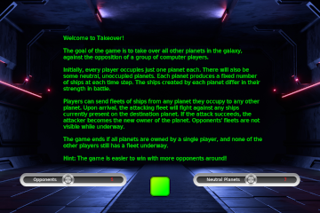
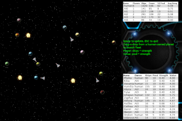

# Takeover: A Turn-Based Strategy Game

Takeover is a casual, turn-based strategy game. It is heavily influenced 
by (or: a clone of) the KDE game [Konquest](https://apps.kde.org/konquest/),
with slightly snazzier graphics and user interface.

|  |  |


## Game Play:

The goal of the game is to take over all other planets in the galaxy, 
against the opposition of a group of computer players.

Initially, every player occupies just one planet each. There will also
be some neutral, unoccupied planets. Each planet produces a fixed
number of ships at each time step. The ships created by each planet
differ in their strength in battle.

Players can send fleets of ships from any planet they occupy to any
other planet. Upon arrival, the arriving fleet will fight against any
ships currently present on the destination planet. If the attack
succeeds, the attacker becomes the new owner of the planet. Opponents'
fleets are not visible while underway.

The game ends if all planets are owned by a single player, and no
player still has a fleet underway.

Hint: The game is easier to win with more opponents around!


## Dependencies and Installation:

This application depends on **Version 2** of the pyglet library.
This version is quite new (November 2022), and most likely _not_
installed as part of a Linux distro.

It is probably easiest to install the dependencies in a virtual
environment. Assuming you have `venv` installed, the following
commands will install `takeover` including its dependencies:

```
python -m venv venv
source venv/bin/activate   # or: source venv/bin/activate.csh
pip install git+https://github.com/janert/takeover

venv/bin/takeover          # this will launch the game
```

Alternatively, you can clone the repo and run the game "from source".
In this case, `pyglet` must be installed explicitly, like so:

```
python -m venv venv
source venv/bin/activate   # or: source venv/bin/activate.csh
pip install pyglet

git clone https://github.com/janert/takeover.git

cd takeover

python -m takeover         # or: python takeover/takeover.py
```


## Credits:

The overall concept was inspired by 
[KDE Konquest](https://apps.kde.org/konquest/).

This application relies heavily on [pyglet](https://github.com/pyglet/pyglet) 
for user interface programming, animations, and event handling. It was
a pleasure to work with pyglet.

The art is, for the most part, not mine. A lot of it comes from 
[OpenGameArt](https://opengameart.org/), in particular the 
[planets](https://opengameart.org/content/20-planet-sprites)
and the [special effects](https://opengameart.org/content/sci-fi-effects).
The splash screen is based on an
[image by user6702303 on Freepik](https://www.freepik.com/free-photo/empty-dark-room-modern-futuristic-sci-fi-background-3d-illustration_21835246.htm#query=empty%20dark%20room%20modern%20futuristic%20background%20sci-fi%203d&position=38&from_view=search&track=ais); the metallic sliders are mine, based on this
[image by pikisuperstar on Freepik](https://www.freepik.com/free-vector/gradient-colored-sliders-collection_21075441.htm#query=21075441&position=0&from_view=search). The [fleet icon](https://icons8.com/icon/Z6KWxqEnwBEq/viper-mark-2)
comes from [icons8](https://icons8.com/).

The planet names were inspired by (and often taken from) 
[here](https://letsmakeagame.net/planet-name-ideas/). 

I may have forgotten to mention something; if you think I am 
infringing on your rights, let me know, so that we can work it
out.


## License:

Copyright (c) 2023, Philipp K. Janert. 
All rights reserved.

Unless otherwise stated in individual files, the contents of this 
repository is licensed under the BSD 3-Clause license found in the
LICENSE file in this directory. 
